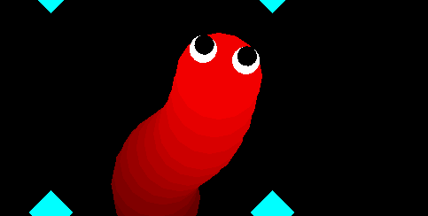

# OpenGL SlitherIo


Snake moves in direction of a mouse, 
snakes eyes gradually move in a direction of a mouse 
while snakes pupils constantly follow it.

Run project by running script run.sh from console, or by doing this:

    1. mkdir build
    2. cd build
    3. cmake ..
    4. make
    5. ./PROJECT (to run app)


## Controls
- ```MOUSE MOTION``` snake direction
- ```UP``` add chunk 
- ```DOWN``` remove chunk
- ```LEFT``` debugging (game ends and prints out snake coordinates)
